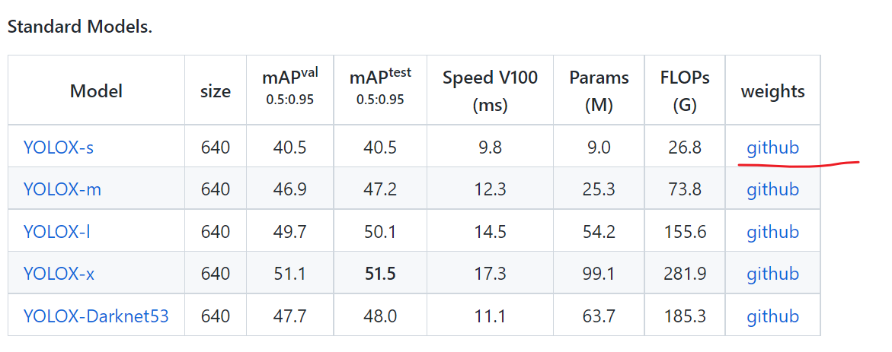

# 基于树莓派摄像头的实时目标检测

> 本项目使用树莓派的摄像头来作为输入源（只要支持rtmp等协议均可），然后使用YOLOx进行实时的目标检测，并通过浏览器来实时浏览其检测结果
> 
> 经过测试，虽然可以达到效果，但是因为画质太差且帧数很低，所以效果不是很好
## 视频文章
[B站]()<br>
[YouTube]()<br>
[掘金](https://juejin.cn/post/7151226728697266189/)
## 文章介绍
[流媒体服务搭建](./video.md)

## 效果展示

## 项目运行
先自己到yolox那里去下载模型：https://github.com/Megvii-BaseDetection/YOLOX 我是下载的最小的那个模型

下载完毕后放到model目录下（自己新建一个），其他配置参数都在`core/__init__.py`文件里面，可以按照自己的需求进行修改
```shell
# 安装依赖
pip install -r requirements.txt
# 自己本地可以随便找个视频进行推流(需要先安装lal服务，参考流媒体搭建)
ffmpeg -re -i tmp.mp4 -c:a copy -c:v copy -f flv rtmp://192.168.1.30:8100/live/origin
# 然后自己修改一下core/__init__.py里面的origin_rtmp和new_rtmp
# 顺便还需要修改web/templates/content.html里的两个地址，然后启动一下项目就可以运行了
```
