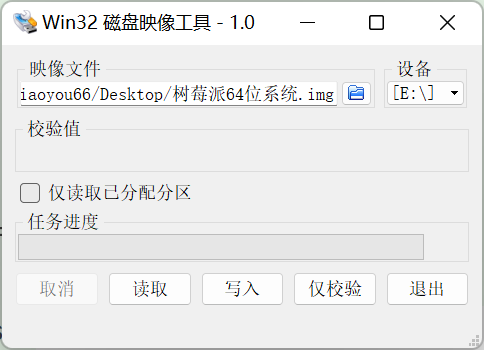
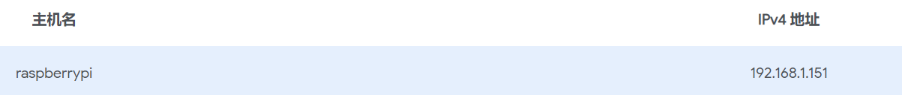
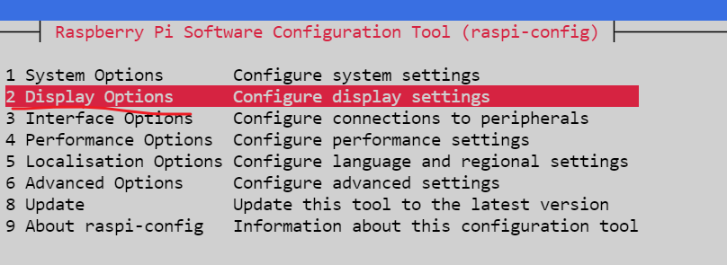
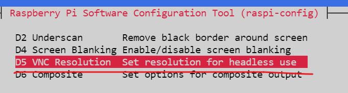
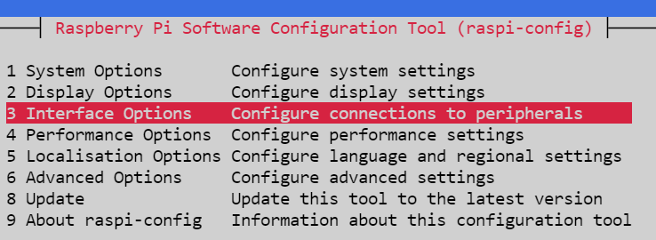
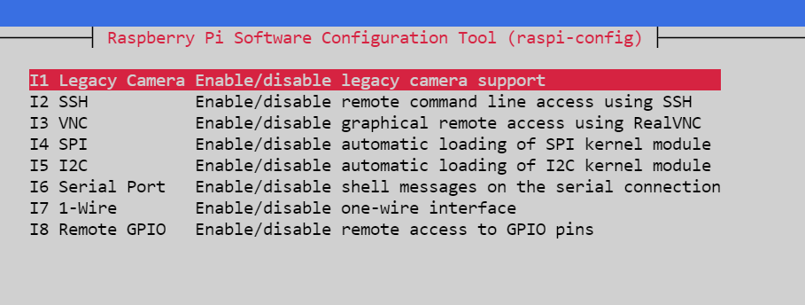

# 流媒体服务搭建

这里我使用的是lal，一款使用go开发的流媒体服务器
仓库地址：https://github.com/q191201771/lal
## 服务安装

直接使用docker安装即可
```shell
sudo docker run -itd -p 1935:1935 -p 8080:8080 -p 4433:4433 -p 5544:5544 -p 8083:8083 -p 8084:8084 -p 30000-30100:30000-30100/udp q191201771/lal /lal/bin/lalserver -c /lal/conf/lalserver.conf.json
```
也可以使用docker-composer
```yaml
version: "3"

services:
  lal:
    container_name: lal
    image: q191201771/lal:latest
    ports:
      - 8100:1935
      - 8101:8080
      - 8102:4433
      - 8103:5544
      - 8104:8083
      - 8105:8084
      - 30000-30100:30000-30100/udp
    volumes:
      - /data/lal/lalserver.conf.json:/lal/conf/lalserver.conf.json
    restart: always
    command: /lal/bin/lalserver -c /lal/conf/lalserver.conf.json
```

```shell
# 本地简单演示
# 推流
ffmpeg -re -i tmp.mp4 -c:a copy -c:v copy -f flv rtmp://192.168.1.30:8100/live/test110
# 拉流
ffplay rtmp://192.168.1.30:8100/live/test110
```

## 树莓系统安装
自己到官网去下载64位镜像：https://www.raspberrypi.com/software/operating-systems/#raspberry-pi-os-64-bit

然后下载磁盘烧写工具：https://sourceforge.net/projects/win32diskimager/files/Archive/



烧写完后给树莓派插上网线，到路由器的管理界面可以看到树莓派的ip地址

默认登录用户名为pi，该账户默认密码是raspberry

## 杂项设置
> 可以使用下面这个命令来设置一下屏幕的分辨率
```shell
sudo raspi-config
```



然后再打开摄像头，可以这样操作




## 摄像头操作
> 因为我下的是最新的系统，所以原来的一些拍照和视频的命令都不能用了，现在统一使用的是libcamera库
这个库主要包括以下几个部分
- libcamera-hello一个简单的“hello world”应用程序，它启动相机预览流并将其显示在屏幕上。
- libcamera-jpeg一个简单的应用程序，用于运行预览窗口然后捕获高分辨率静止图像。
- libcamera-still一个更复杂的静态图像捕捉应用程序，它模拟了raspistill.
- libcamera-vid一个视频捕捉应用程序。
- libcamera-raw直接从传感器捕获原始（未处理的拜耳）帧的基本应用程序。

```shell
# 简单拍一张图片
libcamera-jpeg -o test.jpg
```
如果遇到`the system appears to be configured for the legacy camera stack`的错误，可以这样操作
```shell
# 修改启动文件
sudo vim /boot/config.txt
# 开启摄像头，然后加上一个自动检测摄像头的选项
[all]
dtoverlay=imx219
camera_auto_detect=1

```

然后我们推一下流
```shell
# 树莓派端执行
libcamera-vid -t 0 --mode 800:600 -o - | ffmpeg -i - -s 800x600 -f flv -b 800k -r 30 rtmp://192.168.1.30:8100/live/test110
# 电脑端执行
ffplay rtmp://192.168.1.30:8100/live/test110
```
这个虽然能用，但是延迟实在太高了，高达10s多，如果有更好的方法欢迎提交issue


